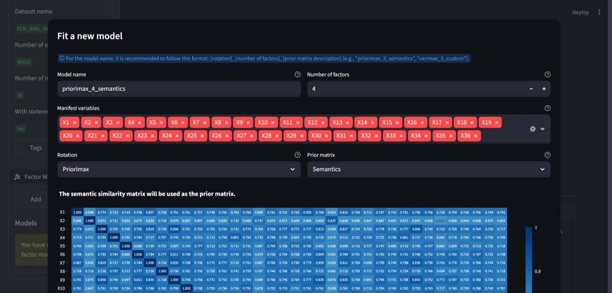
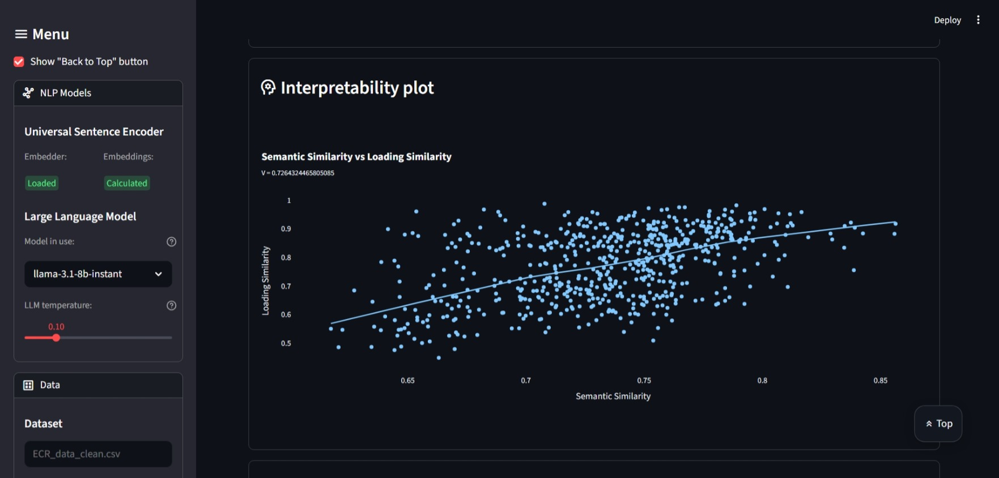
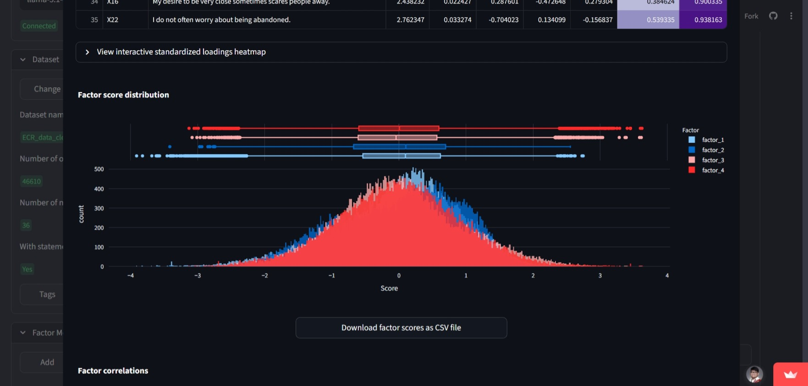
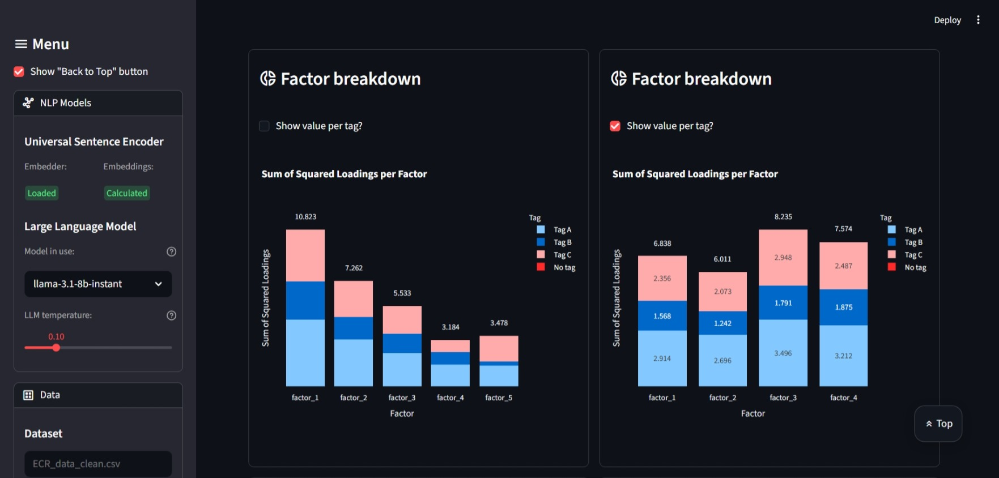
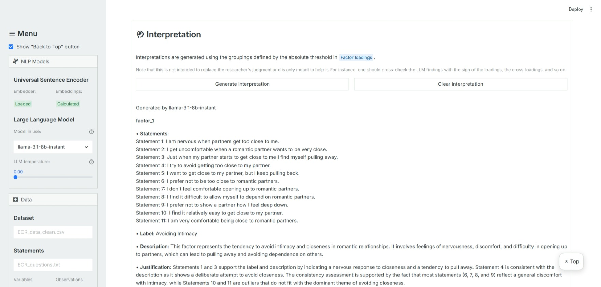

# Description
FactorFlow is an interactive tool intended to help practitioners perform exploratory factor analysis better. Using this tool, users can upload their dataset, fit various factor models, and perform factor rotations. It comes with the following key features or components:
* Readily available classical rotations (e.g., varimax and more) and traditional visualizations (e.g., correlation heatmap) for core exploratory factor analysis
* Implementation of pairwise target rotation and interpretability plots from [Pairwise Target Rotation for Factor Models](https://arxiv.org/abs/2409.11525) for going beyond the classical methods
* Large language model integration for factor model interpretation

Using this tool, practitioners can easily perform exploratory factor analysis and even leverage semantic or arbitrary information for analyzing factor models.

FactorFlow (a Streamlit app) can be accessed here: [https://factorflow-efa.streamlit.app/](https://factorflow-efa.streamlit.app/). Sample datasets to get started can be downloaded [here](https://drive.google.com/drive/u/1/folders/1nc-pZFM5JdxmMrqE_QJyf03DLTEoEH0X).

# Notes
* Right now, the tool does not support a correlation matrix as the main dataset and does not support
polychoric correlations. These will be added in the future.
* The Universal Sentence Encoder is the only embedding model supported right now.
* FactorFlow is made available under the GNU General Public License v3.0.
* The tool can be found [here](https://factorflow-efa.streamlit.app/).
* Sample datasets can be found [here](https://drive.google.com/drive/u/1/folders/1nc-pZFM5JdxmMrqE_QJyf03DLTEoEH0X).
* The code repository for this tool can be found 
[here](https://github.com/jptuazon/factorflow).
* You can reach out to jstuazon@alum.up.edu.ph for related concerns.
