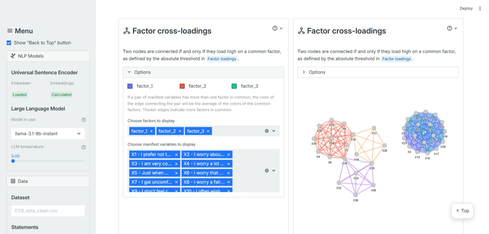
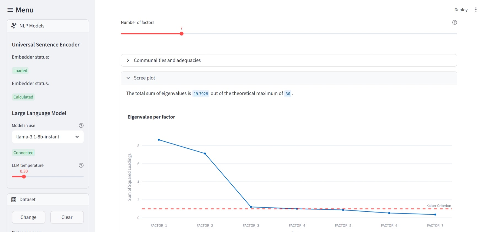
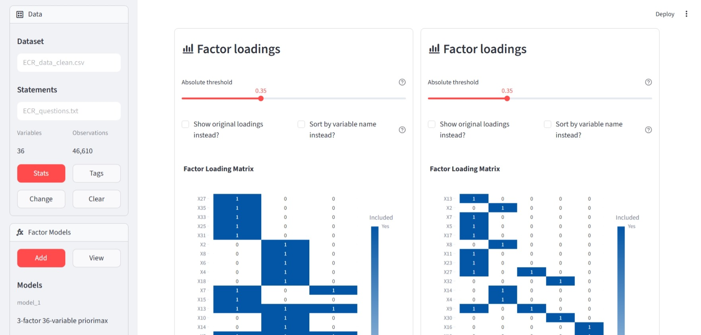
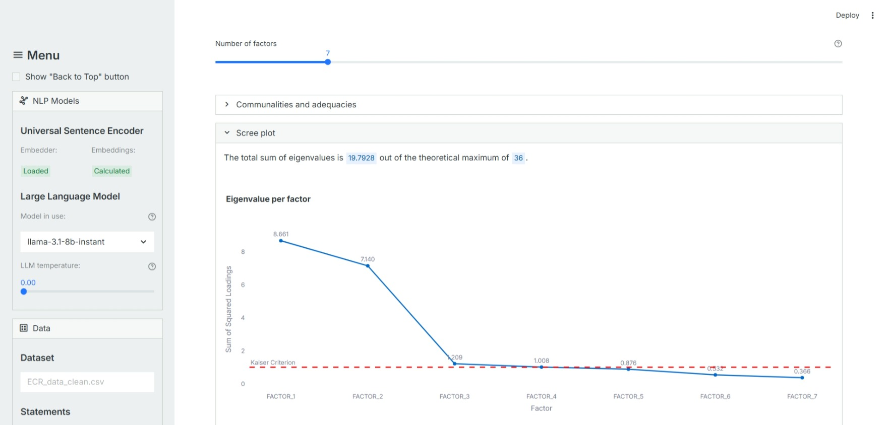
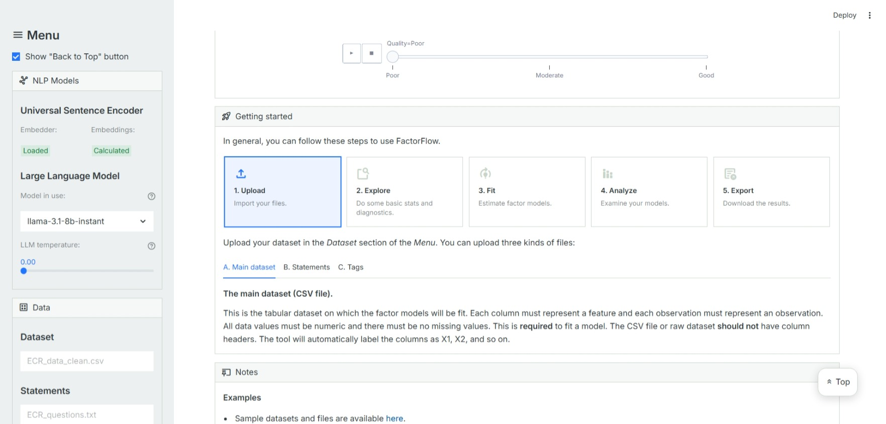

An LLM-enhanced Visual Workbench for Exploratory Factor Analysis

# Description
FactorFlow is an interactive tool intended to help practitioners perform exploratory factor analysis better. Using this tool, users can upload their dataset, fit various factor models, and perform factor rotations. It comes with the following key features or components:
* Readily available classical rotations (e.g., varimax and more) and traditional visualizations (e.g., correlation heatmap) for core exploratory factor analysis
* Implementation of pairwise target rotation and interpretability plots from [Pairwise Target Rotation for Factor Models](https://arxiv.org/abs/2409.11525) for going beyond the classical methods
* Large language model integration for factor model interpretation
* Multiple tabs available for diagnostics, deep dives, and comparisons

Using this tool, practitioners can easily perform exploratory factor analysis and even leverage semantic or arbitrary information for analyzing factor models.

FactorFlow (a Streamlit app) can be accessed here: [https://factorflow-efa.streamlit.app/](https://factorflow-efa.streamlit.app/). A quick guide on how to use the tool is available on the app while sample datasets to get started can be downloaded [here](https://drive.google.com/drive/u/1/folders/1nc-pZFM5JdxmMrqE_QJyf03DLTEoEH0X).

<table border="0">
  <tr>
    <td></td>
    <td></td>
  </tr>
  <tr>
    <td></td>
    <td></td>
  </tr>
  <tr>
    <td></td>
    <td></td>
  </tr>
  <tr>
    <td></td>
    <td></td>
  </tr>
  <tr>
    <td></td>
    <td></td>
  </tr>
</table>

# Notes
* The tool currently does not support polychoric correlations. This will be added in the future.
* The Universal Sentence Encoder is the only embedder available for the statements for now.
* A video walkthrough of the tool is in the works.

# About
* Developer: Justin Philip Tuazon
    * [jstuazon@alum.up.edu.ph](jstuazon@alum.up.edu.ph)
    * [LinkedIn](https://www.linkedin.com/in/justin-philip-tuazon/)
* Adviser: Joemari Olea
* Copyright 2026 Justin Philip Tuazon
