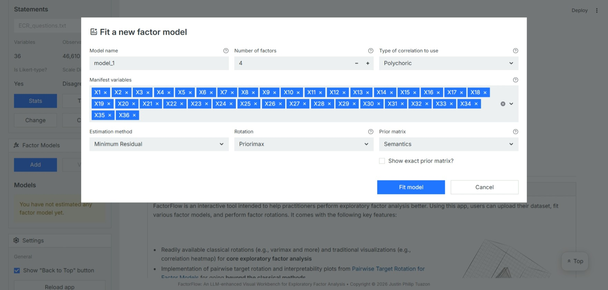
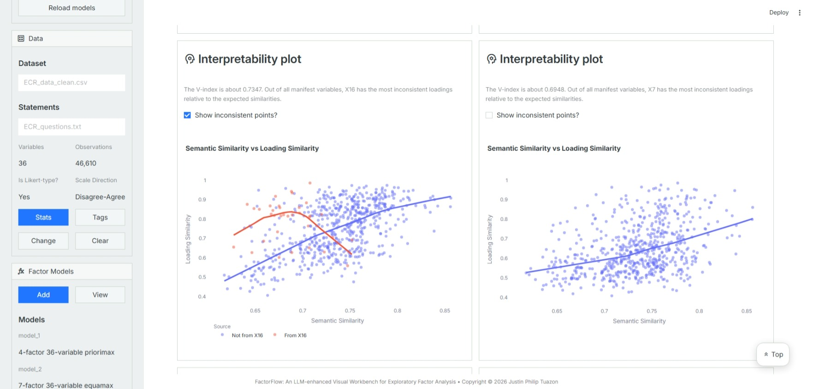
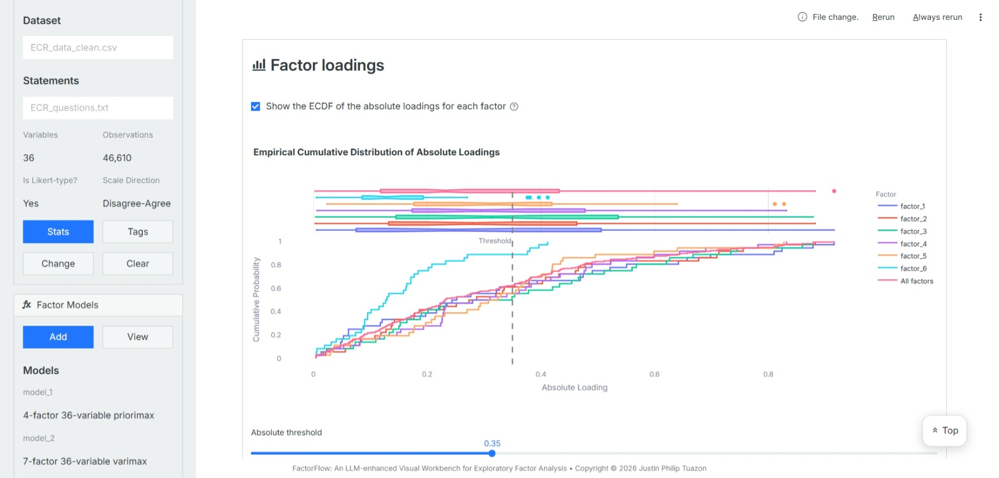
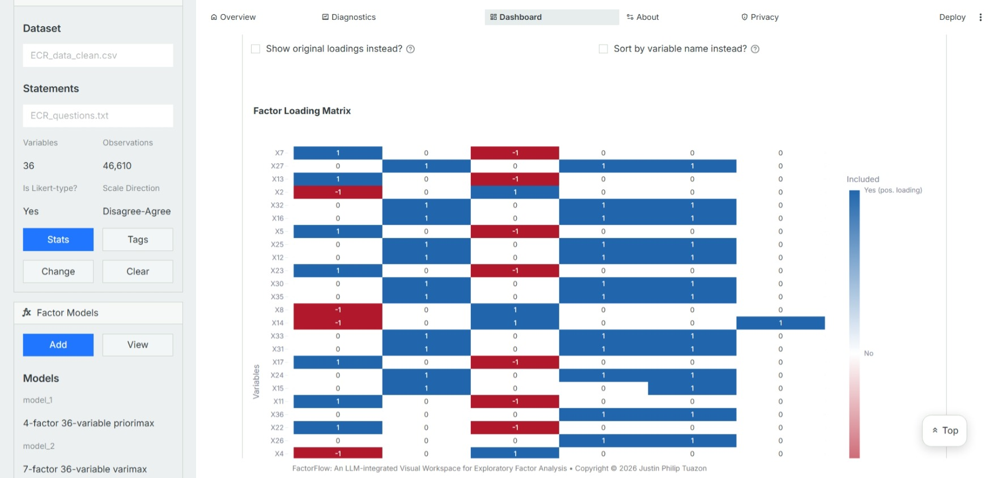
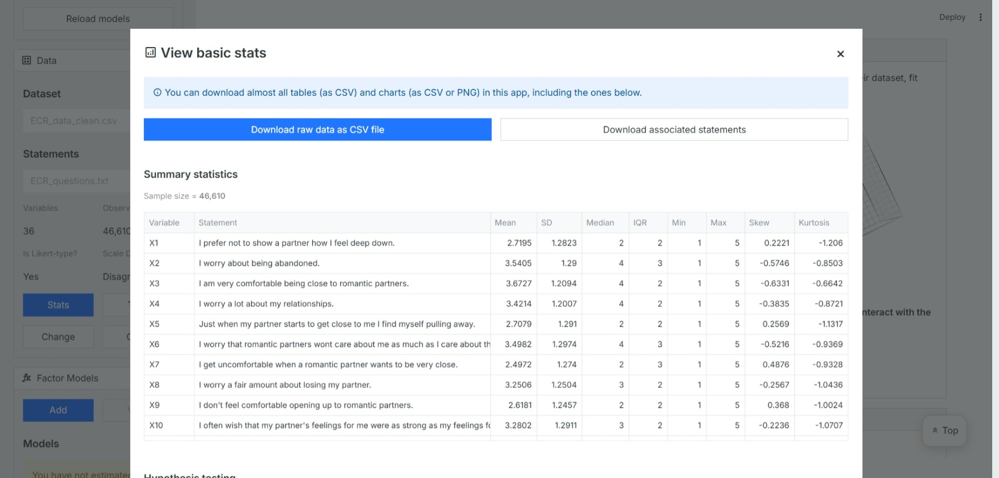
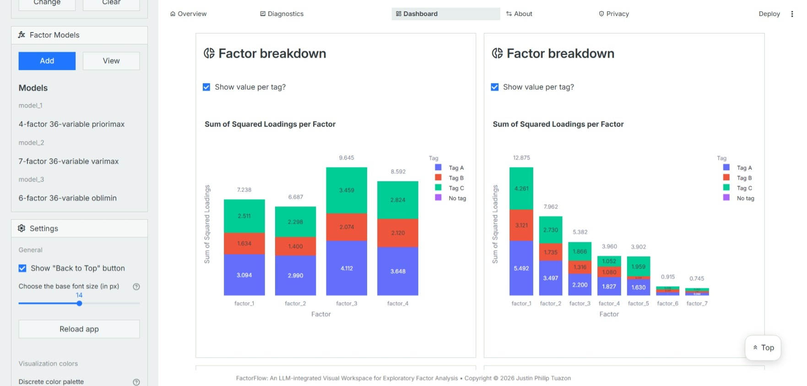
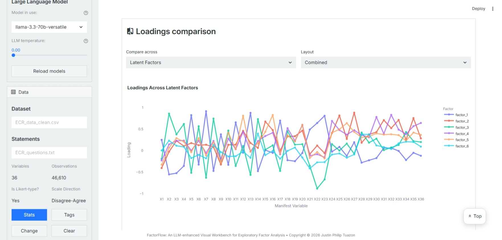
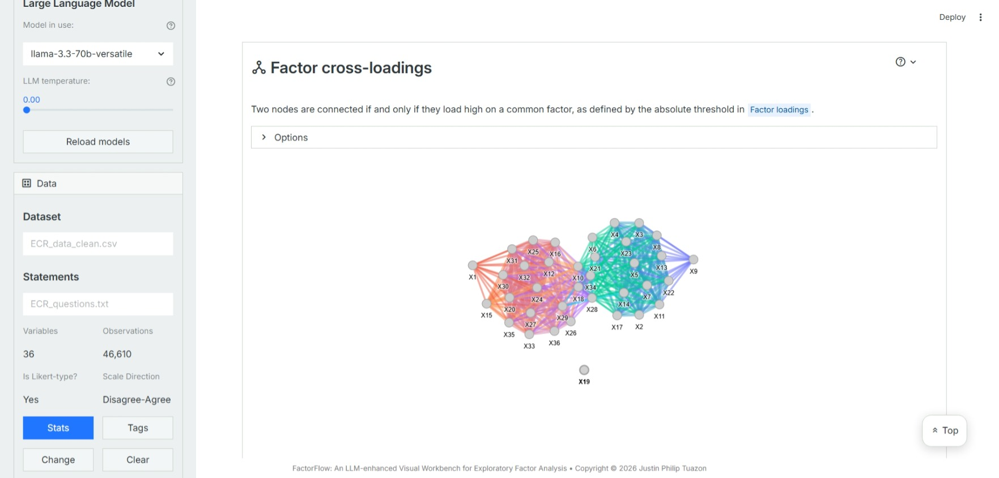
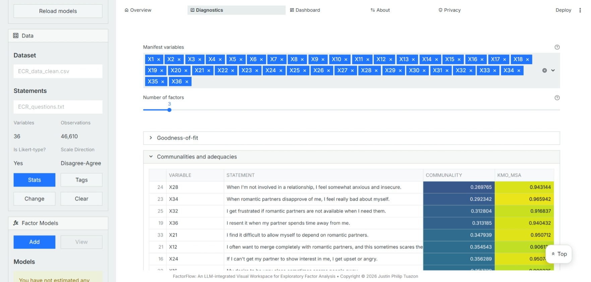
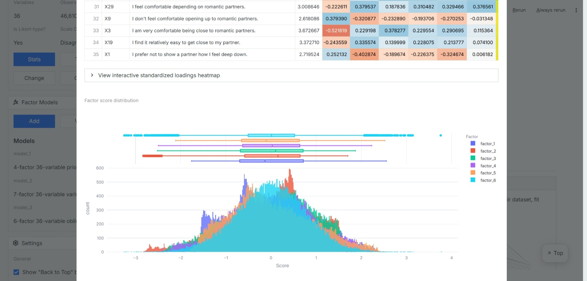

An LLM-enhanced Visual Workbench for Exploratory Factor Analysis

# Description
FactorFlow is an **interactive tool** intended to help researchers and practitioners perform exploratory factor analysis (EFA) effectively and efficiently. Using this app, users can upload their datasets, perform diagnostics, fit various factor models and factor rotations, and evaluate models. It comes with the following key features:

* Readily available classical rotations (e.g., varimax and more) and traditional visualizations (e.g., 
heatmaps) for **core exploratory factor analysis**
* Implementation of pairwise target rotation and interpretability plots from [Pairwise Target Rotation for 
Factor Models](https://arxiv.org/abs/2409.11525) for going **beyond the classical methods**
* **Large language model integration** for factor model interpretation
* Multiple tabs available for **diagnostics, deep dives, and comparisons**

Users can easily perform exploratory factor analysis and even leverage semantic or arbitrary information for analyzing factor models.

FactorFlow (a Streamlit app) can be accessed here: [https://factorflow-efa.streamlit.app/](https://factorflow-efa.streamlit.app/). A quick guide on how to use the tool is available on the app while sample datasets to get started can be downloaded [here](https://drive.google.com/drive/u/1/folders/1nc-pZFM5JdxmMrqE_QJyf03DLTEoEH0X).

<table border="0">
  <tr>
    <td></td>
    <td></td>
  </tr>
  <tr>
    <td></td>
    <td></td>
  </tr>
  <tr>
    <td></td>
    <td></td>
  </tr>
  <tr>
    <td></td>
    <td></td>
  </tr>
  <tr>
    <td></td>
    <td></td>
  </tr>
</table>

# Notes
* The Universal Sentence Encoder is the only embedding model supported right now.
* FactorFlow is made available under the GNU General Public License v3.0.
* The tool can be found [here](https://factorflow-efa.streamlit.app/).
* Sample datasets can be found [here](https://drive.google.com/drive/u/1/folders/1nc-pZFM5JdxmMrqE_QJyf03DLTEoEH0X).
* The code repository for this tool can be found 
[here](https://github.com/jptuazon/factorflow).
* You can reach out to jstuazon@alum.up.edu.ph for concerns.
